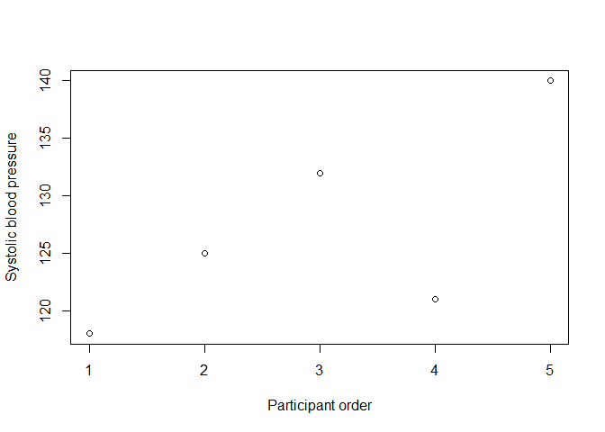
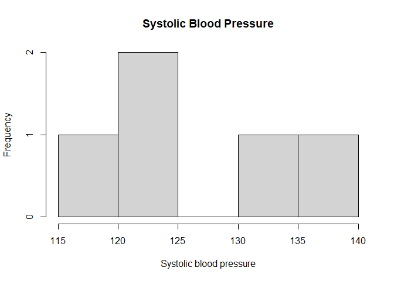

Introduction to R and RStudio
================
Sandeep Kumar Singh, PhD

<script type="text/javascript" async
    src="https://polyfill.io/v3/polyfill.min.js?features=es6">
</script>

<script type="text/javascript" async
    src="https://cdnjs.cloudflare.com/ajax/libs/mathjax/3.2.0/es5/tex-mml-chtml.js">
</script>

# Introduction to R and RStudio

## Why learn R?

Modern statistical, biomedical, epidemiological, public-health, and
genomic research generates data that must be inspected, cleaned,
summarized, analyzed, visualized, and reported reproducibly. R is a
programming language and statistical-computing environment designed
especially well for these tasks.

A researcher may use R to answer questions such as:

- What is the average systolic blood pressure in a study sample?
- How many participants have missing glucose measurements?
- Does body mass index differ between study groups?
- Is smoking associated with disease status?
- How does a biomarker change over follow-up?
- Which variants in a GWAS have the smallest p-values?
- How can an analysis be rerun exactly when new data arrive?

This book begins with the R language itself. Statistical methods will
come later. The immediate goal is to become comfortable giving R
instructions, storing results, inspecting objects, writing scripts, and
organizing research work reproducibly.

> **Learning principle:** Do not try to memorize every command. Learn
> how R thinks, how to inspect what we have, and how to find help when
> we need it.

------------------------------------------------------------------------

## 1.1 What is R?

R is a programming language and an environment for statistical computing
and graphics. When we write an instruction such as:

``` r
2 + 3
```

    ## [1] 5

R interprets the instruction, performs the calculation, and returns the
result.

R can be used for much more than arithmetic. It can:

- import research datasets;
- clean and transform data;
- calculate descriptive and inferential statistics;
- fit statistical models;
- create publication-quality figures;
- work with genomic and other large scientific datasets;
- automate repetitive analyses; and
- generate reproducible reports.

Throughout this book, we will gradually move from simple instructions
such as `2 + 3` to complete research workflows.

## 1.2 What is RStudio?

R and RStudio are related, but they are not the same thing.

**R** is the computational engine. It understands R code and performs
the calculations.

**RStudio** is an integrated development environment (IDE). It provides
a convenient interface for writing scripts, running R, viewing objects,
navigating files, displaying plots, and reading help documentation.

A useful analogy is:

> **R is the engine; RStudio is the dashboard and workspace used to
> control it.**

Installing RStudio does not replace R. In a typical setup, R is
installed first and RStudio uses that R installation.

## 1.3 The RStudio interface

A standard RStudio session is commonly divided into four panes. Their
exact positions can be customized, but the functions remain similar.

### Source pane

The Source pane is where scripts and other source documents are opened
and edited. A script lets us save code so that it can be reviewed,
corrected, and rerun later.

### Console pane

The Console is where R actually executes commands. We will usually see a
prompt such as:

``` text
>
```

If we type:

``` r
2 + 3
```

and press Enter, R evaluates the expression immediately.

### Environment pane

The Environment shows objects currently available in the R session. If
we create:

``` r
weight <- 75
```

an object called `weight` will normally appear in the Environment.

### Files, Plots, Packages, and Help pane

This pane provides several useful tabs. For example:

- **Files** helps navigate files and folders;
- **Plots** displays graphics created by R;
- **Packages** displays installed packages;
- **Help** displays documentation.

Do not worry about mastering every pane immediately. The Console and
Source panes are the most important starting points.

------------------------------------------------------------------------

## 1.4 Using R as a calculator

R can perform ordinary arithmetic.

``` r
2 + 3
```

    ## [1] 5

``` r
10 - 4
```

    ## [1] 6

``` r
6 * 5
```

    ## [1] 30

``` r
20 / 4
```

    ## [1] 5

``` r
2^3
```

    ## [1] 8

The main arithmetic operators are:

| Operation      | Operator | Example |
|----------------|:--------:|---------|
| Addition       |   `+`    | `5 + 2` |
| Subtraction    |   `-`    | `5 - 2` |
| Multiplication |   `*`    | `5 * 2` |
| Division       |   `/`    | `5 / 2` |
| Exponentiation |   `^`    | `5^2`   |

### Why does R print `[1]`?

You may see output such as:

``` text
[1] 5
```

The `[1]` is **not part of the answer**. It indicates that the first
value displayed on that output line is element number 1. This becomes
more useful when R prints many values.

For now, simply interpret:

``` text
[1] 5
```

as the result `5`.

------------------------------------------------------------------------

## 1.5 A first biomedical calculation: body mass index

Body mass index (BMI) is commonly calculated as:

$$BMI = \frac{weight\;(kg)}{height\;(m)^2}$$

For a person weighing 75 kg with a height of 1.75 m:

``` r
75 / (1.75^2)
```

    ## [1] 24.4898

R returns the calculated BMI. We can make the result easier to read by
rounding it:

``` r
round(75 / (1.75^2), 2)
```

    ## [1] 24.49

Here `round()` is an R **function**. We will return to functions
shortly.

> **Important:** At this stage, BMI is being used to teach R syntax.
> Clinical interpretation of measurements belongs to the relevant
> biomedical or statistical context.

------------------------------------------------------------------------

## 1.6 Objects: storing information in R

Repeatedly typing values is inefficient. R allows us to store
information in **objects**.

``` r
weight <- 75
height <- 1.75
```

Read the first line as:

> Assign the value `75` to an object called `weight`.

Now type the object name:

``` r
weight
```

    ## [1] 75

``` r
height
```

    ## [1] 1.75

R retrieves the stored values.

We can use these objects in calculations:

``` r
bmi <- weight / height^2
bmi
```

    ## [1] 24.4898

And round the result:

``` r
round(bmi, 2)
```

    ## [1] 24.49

The workflow is now:

``` text
raw values
   ↓
objects
   ↓
calculation
   ↓
new object
   ↓
result
```

This pattern will occur throughout the book.

## 1.7 Understanding the assignment operator `<-`

The symbol:

``` r
<-
```

is the traditional assignment operator in R.

For example:

``` r
age <- 44
```

means:

> Create or update the object `age` and assign the value 44 to it.

The direction matters conceptually:

``` text
age <- 44
```

can be read as:

``` text
age receives 44
```

R also permits `=` for assignment in many situations, but this book will
primarily use `<-` because it clearly distinguishes assignment from
other uses of `=` that appear later in function calls.

### Keyboard shortcut

In RStudio, the assignment operator can usually be inserted with:

``` text
Alt + -
```

On macOS, the corresponding shortcut is commonly:

``` text
Option + -
```

------------------------------------------------------------------------

## 1.8 Object names

Good object names make analyses easier to understand.

Examples of useful names include:

``` r
age
weight
height
bmi
systolic_bp
fasting_glucose
participant_id
```

A common style is **snake_case**, where words are separated by
underscores:

``` r
systolic_blood_pressure
```

Prefer descriptive names over vague names such as:

``` r
x
x1
data2
final_final
```

Short names can be appropriate in mathematics or temporary calculations,
but research code benefits from clarity.

### Case sensitivity

R is case-sensitive. These are different names:

``` r
age
Age
AGE
```

For example:

``` r
age <- 44
age
```

    ## [1] 44

Trying to use `Age` would fail unless an object with that exact
capitalization had also been created.

------------------------------------------------------------------------

## 1.9 Inspecting objects in the current session

Create a few objects:

``` r
age <- 44
weight <- 75
height <- 1.75
bmi <- weight / height^2
```

To list objects in the current workspace, use:

``` r
ls()
```

    ## [1] "age"    "bmi"    "height" "weight"

To remove a particular object:

``` r
rm(bmi)
```

To remove all objects from the current workspace, you may encounter:

``` r
rm(list = ls())
```

This command is useful in some circumstances but should be used
deliberately: it removes all objects in the current workspace. A
reproducible analysis should ideally be able to rebuild required objects
by rerunning its scripts rather than depending on manually preserved
workspace contents.

------------------------------------------------------------------------

## 1.10 Console versus script

This distinction is fundamental.

### Console

The Console is useful for quick experimentation:

``` r
2 + 3
sqrt(16)
```

But commands entered only in the Console are not a well-organized record
of the analysis.

### R script

An R script is a plain-text file containing R code. Its extension is
usually:

``` text
.R
```

For example:

``` text
chapter01_practice.R
```

A script might contain:

``` r
weight <- 75
height <- 1.75
bmi <- weight / height^2
round(bmi, 2)
```

The script can be saved, reopened, edited, shared, and rerun.

### Running code from a script

In RStudio, place the cursor on a line of code and use:

``` text
Ctrl + Enter
```

On macOS this is commonly:

``` text
Command + Enter
```

You can also highlight several lines and run them together.

> **Research habit:** Use the Console for exploration. Put analysis that
> matters into scripts.

------------------------------------------------------------------------

## 1.11 Comments: explaining your code

R ignores text following `#` on a line.

``` r
# Participant measurements
weight <- 75       # kilograms
height <- 1.75     # metres

# Calculate BMI
bmi <- weight / height^2
round(bmi, 2)
```

    ## [1] 24.49

Comments should explain **why** something is being done when that is not
obvious from the code.

Less useful:

``` r
# Calculate mean
mean(sbp)
```

More informative:

``` r
# Summarize baseline systolic blood pressure across participants
mean(sbp)
```

Good comments help future you, collaborators, reviewers, and students
understand the analysis.

------------------------------------------------------------------------

## 1.12 Functions: asking R to perform a task

R contains many functions. A function generally follows the pattern:

``` text
function_name(arguments)
```

For example:

``` r
sqrt(25)
```

    ## [1] 5

``` r
round(3.1415926, 2)
```

    ## [1] 3.14

In:

``` r
round(3.1415926, 2)
```

- `round` is the function name;
- the parentheses contain information supplied to the function;
- `3.1415926` is the value being rounded;
- `2` tells R how many decimal places to retain.

Functions are central to R. Later, you will learn to write your own.

------------------------------------------------------------------------

## 1.13 Your first collection of biomedical measurements

Suppose systolic blood pressure was recorded for five participants:

``` text
118, 125, 132, 121, 140
```

We can combine these values using `c()`:

``` r
sbp <- c(118, 125, 132, 121, 140)
sbp
```

    ## [1] 118 125 132 121 140

The `c()` function combines values into a **vector**.

Vectors are so important that they receive an entire chapter later. For
now, think of `sbp` as one object containing several measurements.

## 1.14 Simple summaries

Once the measurements are stored together, R can summarize them easily.

``` r
mean(sbp)
```

    ## [1] 127.2

``` r
length(sbp)
```

    ## [1] 5

``` r
min(sbp)
```

    ## [1] 118

``` r
max(sbp)
```

    ## [1] 140

``` r
range(sbp)
```

    ## [1] 118 140

``` r
summary(sbp)
```

    ##    Min. 1st Qu.  Median    Mean 3rd Qu.    Max. 
    ##   118.0   121.0   125.0   127.2   132.0   140.0

For now, interpret these functions as follows:

| Function       | Purpose                 |
|----------------|-------------------------|
| `mean(sbp)`    | arithmetic mean         |
| `length(sbp)`  | number of values        |
| `min(sbp)`     | smallest value          |
| `max(sbp)`     | largest value           |
| `range(sbp)`   | minimum and maximum     |
| `summary(sbp)` | quick numerical summary |

The statistical interpretation of these summaries will be developed
later. At this stage, the important idea is that an R function can
operate on an object containing multiple observations.

## 1.15 Saving a result as another object

Instead of only printing a calculation:

``` r
mean(sbp)
```

    ## [1] 127.2

we can save it:

``` r
mean_sbp <- mean(sbp)
mean_sbp
```

    ## [1] 127.2

This allows the result to be reused:

``` r
round(mean_sbp, 1)
```

    ## [1] 127.2

This distinction appears constantly in R:

``` text
mean(sbp)
```

calculates and prints a result, whereas:

``` text
mean_sbp <- mean(sbp)
```

calculates the result and stores it in an object.

------------------------------------------------------------------------

## 1.16 A second example: participant ages

Suppose five study participants are aged:

``` r
age <- c(34, 52, 46, 67, 29)
age
```

    ## [1] 34 52 46 67 29

We can ask basic questions:

``` r
length(age)
```

    ## [1] 5

``` r
mean(age)
```

    ## [1] 45.6

``` r
min(age)
```

    ## [1] 29

``` r
max(age)
```

    ## [1] 67

``` r
range(age)
```

    ## [1] 29 67

``` r
summary(age)
```

    ##    Min. 1st Qu.  Median    Mean 3rd Qu.    Max. 
    ##    29.0    34.0    46.0    45.6    52.0    67.0

Notice the general pattern:

``` text
measurements → object → function → result
```

The same pattern can later be applied to glucose, cholesterol,
gene-expression measurements, GWAS effect estimates, and many other
forms of scientific data.

------------------------------------------------------------------------

## 1.17 A first look at plots

R can create graphics directly.

``` r
plot(sbp,
     xlab = "Participant order",
     ylab = "Systolic blood pressure")
```

<figure>

<figcaption aria-hidden="true">Systolic blood pressure measurements for
five participants.</figcaption>
</figure>

A histogram can also be produced:

``` r
hist(sbp,
     xlab = "Systolic blood pressure",
     main = "Systolic Blood Pressure")
```

<figure>

<figcaption aria-hidden="true">Histogram of the five systolic blood
pressure measurements used in the introductory example.</figcaption>
</figure>

Do not focus on customization yet. These examples simply demonstrate
that the same object used for calculations can also be visualized.

A later chapter will teach graphics systematically.

------------------------------------------------------------------------

## 1.18 Files, folders, and the working directory

Research analyses depend on files. R therefore needs to know where files
are located.

The **working directory** is the folder R currently treats as its
default location for relative file operations.

Check it with:

``` r
getwd()
```

    ## [1] "E:/Github_Classes/R for Everyone/R-for-Everyone/chapters"

The result will depend on your computer and current R/RStudio setup.

You can inspect files in the current directory using:

``` r
list.files()
```

    ## [1] "01-introduction-to-r.html"  "01-introduction-to-r.md"   
    ## [3] "01-introduction-to-r.Rmd"   "01-introduction-to-r_files"

### `setwd()`

R provides:

``` r
setwd("path/to/folder")
```

to change the working directory.

For example, on Windows you might see a path conceptually like:

``` r
setwd("D:/Research/R_Biostatistics")
```

However, repeatedly hard-coding personal absolute paths with `setwd()`
makes projects harder to move between computers.

Later in the book we will develop a much better project structure using
RStudio Projects, project roots, relative paths, `file.path()`,
raw/processed-data folders, and reproducible file workflows.

For now, remember:

> R needs a location from which to find input files and save outputs.

------------------------------------------------------------------------

## 1.19 Absolute and relative paths: an early preview

Suppose a project eventually has this structure:

``` text
R_Biostatistics/
├── data/
│   └── participants.csv
├── scripts/
│   └── analysis.R
└── results/
```

An **absolute path** contains the full location on a particular
computer, for example:

``` text
D:/Research/R_Biostatistics/data/participants.csv
```

A **relative path** describes the file relative to the project location:

``` text
data/participants.csv
```

Relative paths generally make research projects easier to move and
share.

We are only introducing the concept here. File and folder management
will receive dedicated chapters later.

------------------------------------------------------------------------

## 1.20 Getting help in R

No R user remembers every function and argument. Knowing how to find
documentation is part of knowing R.

### Help for a known function

``` r
?mean
```

or:

``` r
help(mean)
```

opens documentation for `mean()`.

### Search when you do not know the exact function name

``` r
help.search("mean")
```

A common shorthand is:

``` r
??mean
```

### View examples

For many functions:

``` r
example(mean)
```

runs examples from the documentation.

When reading a help page, gradually become familiar with sections such
as:

- **Description** — what the function does;
- **Usage** — how the function is called;
- **Arguments** — inputs accepted by the function;
- **Value** — what the function returns;
- **Examples** — example code.

You do not need to understand every line of documentation immediately.

------------------------------------------------------------------------

## 1.21 Reading an R command from the inside out

Consider:

``` r
round(mean(sbp), 1)
```

R first evaluates:

``` r
mean(sbp)
```

and then supplies that result to:

``` r
round(..., 1)
```

So nested function calls are often easiest to understand from the inside
outward.

You could write the same process in two steps:

``` r
mean_sbp <- mean(sbp)
round(mean_sbp, 1)
```

    ## [1] 127.2

Both approaches are valid. When learning, breaking complicated
expressions into smaller steps often improves readability.

------------------------------------------------------------------------

## 1.22 Common beginner errors

Errors are a normal part of programming. The goal is not to avoid every
error; it is to learn how to read and diagnose them.

### Error 1: object not found

Suppose you write:

``` r
mean(SBP)
```

but created:

``` r
sbp <- c(118, 125, 132)
```

Because R is case-sensitive, `SBP` and `sbp` are different names.

A typical error is:

``` text
Error: object 'SBP' not found
```

Check spelling and capitalization.

### Error 2: forgetting a closing parenthesis

Incorrect:

``` r
mean(sbp
```

R may show a continuation prompt:

``` text
+
```

because it is waiting for the expression to be completed.

Complete the command or press `Esc` in RStudio to cancel the unfinished
instruction.

### Error 3: typing text without quotation marks

Later we will store text values. Writing:

``` r
sex <- Female
```

makes R look for an object called `Female`.

Text generally needs quotation marks:

``` r
sex <- "Female"
```

### Error 4: using an object before creating it

This will fail in a fresh session:

``` r
bmi <- weight / height^2
```

if `weight` and `height` have not yet been created.

A script should therefore be runnable in a sensible order.

### Error 5: overwriting an object unintentionally

``` r
weight <- 75
weight <- 82
```

The object `weight` now contains `82`. The previous value has been
replaced.

This behavior is useful when intentional and problematic when
accidental.

------------------------------------------------------------------------

## 1.23 Reproducibility: a habit from the first chapter

Suppose you calculate BMI manually in the Console and close RStudio. A
week later, you may not remember exactly what you did.

Instead, save a script:

``` r
# Participant measurements
weight <- 75
height <- 1.75

# Calculate BMI
bmi <- weight / height^2

# Display BMI rounded to two decimal places
round(bmi, 2)
```

Now the analysis is explicit and repeatable.

This simple idea scales directly to serious research. A future analysis
might contain steps such as:

``` text
Import raw data
      ↓
Perform quality control
      ↓
Clean variables
      ↓
Create analysis dataset
      ↓
Run statistical model
      ↓
Generate tables and figures
      ↓
Export results
```

A reproducible workflow preserves those instructions rather than relying
on memory or manual clicking.

------------------------------------------------------------------------

## 1.24 Guided practical: BMI calculation

Create a new R script and enter the following code yourself.

``` r
# Measurements
weight <- 82
height <- 1.78

# BMI calculation
bmi <- weight / height^2

# Display result
bmi
```

    ## [1] 25.88057

``` r
# Display rounded result
round(bmi, 2)
```

    ## [1] 25.88

### Questions

1.  What values are stored in `weight` and `height`?
2.  Which line creates the `bmi` object?
3.  What happens if `height` is changed to `1.80` and the BMI line is
    rerun?
4.  What happens if you change `height` but print `bmi` **without
    rerunning the BMI calculation**?

The fourth question introduces an important idea: R objects do not
automatically recalculate simply because an input object changed.

For example:

``` r
weight <- 82
height <- 1.78
bmi <- weight / height^2

height <- 1.80

bmi
```

    ## [1] 25.88057

The stored `bmi` still reflects the earlier calculation. To update it,
rerun:

``` r
bmi <- weight / height^2
bmi
```

    ## [1] 25.30864

This becomes important in long analysis pipelines.

------------------------------------------------------------------------

## 1.25 Guided practical: glucose measurements

Suppose fasting glucose was recorded for six participants:

``` r
glucose <- c(92, 101, 98, 110, 105, 95)
```

Perform the following operations:

``` r
glucose
```

    ## [1]  92 101  98 110 105  95

``` r
length(glucose)
```

    ## [1] 6

``` r
mean(glucose)
```

    ## [1] 100.1667

``` r
min(glucose)
```

    ## [1] 92

``` r
max(glucose)
```

    ## [1] 110

``` r
range(glucose)
```

    ## [1]  92 110

``` r
summary(glucose)
```

    ##    Min. 1st Qu.  Median    Mean 3rd Qu.    Max. 
    ##   92.00   95.75   99.50  100.17  104.00  110.00

Now save the mean:

``` r
mean_glucose <- mean(glucose)
round(mean_glucose, 1)
```

    ## [1] 100.2

### Think about the workflow

Which objects now exist?

``` r
ls()
```

    ## [1] "age"          "bmi"          "glucose"      "height"       "mean_glucose"
    ## [6] "mean_sbp"     "sbp"          "weight"

You should begin to see that an R session consists of objects created by
executing instructions.

------------------------------------------------------------------------

## 1.26 Independent exercise: cholesterol measurements

Create an object called `cholesterol` containing:

``` text
182, 205, 194, 221, 176, 199
```

Without copying the solution from another example, write R code to:

1.  print the measurements;
2.  count the number of observations;
3.  calculate the mean;
4.  find the minimum;
5.  find the maximum;
6.  obtain the range;
7.  obtain `summary()`;
8.  save the mean as `mean_cholesterol`;
9.  round the saved mean to one decimal place; and
10. create a simple plot of the measurements.

A possible solution is provided below. Try the exercise before revealing
it.

<details>

<summary>

<strong>Show solution</strong>
</summary>

``` r
cholesterol <- c(182, 205, 194, 221, 176, 199)

cholesterol
length(cholesterol)
mean(cholesterol)
min(cholesterol)
max(cholesterol)
range(cholesterol)
summary(cholesterol)

mean_cholesterol <- mean(cholesterol)
round(mean_cholesterol, 1)

plot(cholesterol,
     xlab = "Participant order",
     ylab = "Cholesterol")
```

</details>

------------------------------------------------------------------------

## 1.27 Challenge: create your first small research script

Create a file called:

``` text
chapter01_practice.R
```

Write a script that performs the following tasks:

1.  creates an object `study_name` containing a short study name;
2.  creates an object `participant_count` containing the value `5`;
3.  stores five systolic blood pressure measurements in `sbp`;
4.  calculates their mean and stores it as `mean_sbp`;
5.  prints the mean rounded to one decimal place;
6.  prints the minimum and maximum values;
7.  creates a simple plot;
8.  uses comments to separate the script into logical sections.

The goal is not merely to obtain an answer. The goal is to produce a
script that another person could read and rerun.

------------------------------------------------------------------------

## 1.28 A model Chapter 1 script

A well-organized beginner script might look like this:

``` r
# ============================================================
# R for Biomedical and Biostatistical Research
# Chapter 1 Practice
# Purpose: Learn basic R objects, functions, and scripts
# ============================================================

# Study information ------------------------------------------

study_name <- "Blood Pressure Training Study"
participant_count <- 5


# Measurements -----------------------------------------------

sbp <- c(118, 125, 132, 121, 140)


# Simple summaries -------------------------------------------

mean_sbp <- mean(sbp)

round(mean_sbp, 1)
min(sbp)
max(sbp)
range(sbp)
summary(sbp)


# Simple visualization ---------------------------------------

plot(sbp,
     xlab = "Participant order",
     ylab = "Systolic blood pressure",
     main = "Systolic Blood Pressure")
```

Notice that the script is organized into sections and can be rerun from
top to bottom.

------------------------------------------------------------------------

## 1.29 Good habits to develop immediately

As you continue learning R, adopt these habits from the beginning:

1.  **Write important code in scripts.** Do not rely on Console history.
2.  **Use descriptive object names.** `fasting_glucose` is more
    informative than `x1`.
3.  **Use consistent naming.** `snake_case` is a good default.
4.  **Comment the purpose of important steps.** Avoid comments that
    merely repeat obvious syntax.
5.  **Keep raw research data unchanged.** Later chapters will show how
    to separate raw, intermediate, and processed data.
6.  **Run scripts in logical order.** Objects must exist before later
    code uses them.
7.  **Read error messages.** They often tell you what is wrong.
8.  **Use the help system.** Looking up documentation is normal
    programming practice.
9.  **Prefer reproducible instructions over manual clicking.**
10. **Do not memorize blindly.** Understand the pattern behind the code.

------------------------------------------------------------------------

## 1.30 Essential commands from Chapter 1

| Purpose                   | Example             |
|---------------------------|---------------------|
| Addition                  | `2 + 3`             |
| Multiplication            | `5 * 4`             |
| Exponentiation            | `2^3`               |
| Create an object          | `age <- 44`         |
| Print an object           | `age`               |
| Combine values            | `c(34, 52, 46)`     |
| Square root               | `sqrt(25)`          |
| Round                     | `round(3.14159, 2)` |
| Mean                      | `mean(sbp)`         |
| Number of values          | `length(sbp)`       |
| Minimum                   | `min(sbp)`          |
| Maximum                   | `max(sbp)`          |
| Range                     | `range(sbp)`        |
| Quick summary             | `summary(sbp)`      |
| List current objects      | `ls()`              |
| Remove an object          | `rm(age)`           |
| Current working directory | `getwd()`           |
| List files                | `list.files()`      |
| Function help             | `?mean`             |
| Search help               | `??mean`            |
| Function examples         | `example(mean)`     |

------------------------------------------------------------------------

## 1.31 Chapter summary

In this chapter, you learned the basic language of an R session.

You learned that:

- R is the computational language and RStudio is an interface for
  working with R;
- the Console executes commands, while scripts preserve code;
- `<-` assigns a value to an object;
- objects can be reused in later calculations;
- R is case-sensitive;
- functions perform tasks on supplied inputs;
- `c()` can combine several measurements into one object;
- functions such as `mean()`, `min()`, `max()`, and `summary()` can
  operate on those measurements;
- comments help document research code;
- R works with files relative to a working location;
- built-in documentation is available through `?`, `help()`, `??`, and
  `example()`; and
- reproducibility begins with saving clear, rerunnable code.

The most important conceptual progression is:

``` text
Instruction
   ↓
Object
   ↓
Function
   ↓
Result
   ↓
Saved script
   ↓
Reproducible analysis
```

You do **not** yet need to understand data frames, factors, loops,
packages, statistical tests, or genomic file formats. Each will be
introduced systematically when the necessary foundations are in place.

------------------------------------------------------------------------

## 1.32 Check your understanding

Answer these questions without running R first. Then use R to verify
your answers.

1.  What is the difference between R and RStudio?
2.  What does `<-` do?
3.  What is an R object?
4.  Why is `age` different from `Age`?
5.  What does `c()` do in `c(120, 125, 130)`?
6.  What is the difference between typing code in the Console and saving
    it in a script?
7.  What does `#` mean in an R script?
8.  What does `length(sbp)` tell you?
9.  Why might `mean_sbp <- mean(sbp)` be preferable to only running
    `mean(sbp)`?
10. What does `getwd()` report?
11. Why are relative paths generally preferable for a portable research
    project?
12. How would you open the help page for `mean()`?
13. If `weight` changes after `bmi` was calculated, does the existing
    `bmi` object automatically change?
14. Why should research code be saved rather than reconstructed from
    memory?

------------------------------------------------------------------------

## 1.33 What comes next?

Chapter 1 treated objects mostly as simple containers. But R objects can
store different kinds of information.

Consider:

``` r
age <- 44
participant_id <- "P001"
disease <- TRUE
```

These values are not all the same kind of data. `44` is numerical,
`"P001"` is text, and `TRUE` is logical information.

The next chapter therefore asks:

> **What kinds of values can R store, and how does R represent them?**

That leads to **Chapter 2 — Objects, Variables, and Basic Data Types**.
